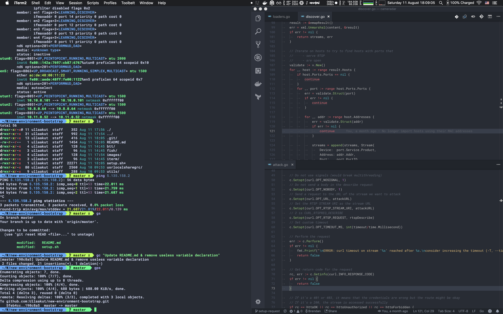
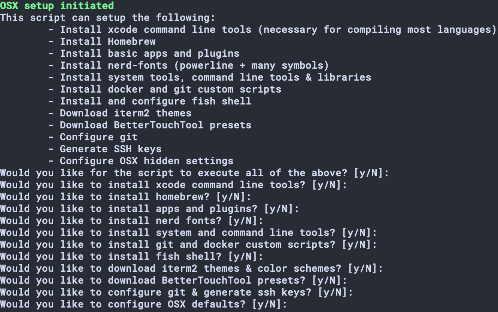

# New Environment Bootstrap

* Run `./setup.sh` and choose what you want it to automatically install
  * Install xcode command line tools (necessary for compiling most languages)
  * Install Homebrew
  * Install basic apps and plugins
  * Install nerd-fonts (powerline + many symbols)
  * Install system tools, command line tools & libraries
  * Install docker and git custom scripts
  * Install and configure fish shell
  * Download iterm2 themes
  * Download BetterTouchTool presets
  * Configure git
  * Generate SSH keys
  * Configure OSX hidden settings
* Manually install
  * VLC
  * Microsoft Office
  * Stremio
  * TeamViewer
  * Disk Inventory X
  * Adobe Photoshop
  * Spectacle
  * Transmission
  * High Sierra Media Key Enabler
    * Open at login
  * Chrome extensions
    * AdBlock Plus
    * Appear.in screen sharing
    * Material Theme for Dev tools
    * No Coin (bitcoin miner blocker)
    * Social Fixer for Facebook
    * Stylus
      * CircleCI Dark
      * Clear Dark Facebook
      * Dark gmail
      * Dark Google Calendar
      * Dark HN
      * Dark TwitchTV
      * GitHub Dark
      * Godoc.org Dark
      * Google clean dark
      * Slack Night mode
      * Stackoverflow dark
      * Stylus dark
      * Toggl Dark Theme
      * Wikipedia dark material design
* Change settings
  * OSX
    * Hot corner to lock
    * Reduce keypress for accents as much as possible
    * Put dock on the right
    * Disable dashboard
    * Reverse scroll
    * Make trackpad as easy as possible
    * Backup
  * iStat Menu
    * Change fan configuration to keep CPU cool
    * Try to make it look like this  
  * VScode
    * Import configuration
    * Install extensions
      * VS Live Share
      * Go
      * LaTeX Workshop
      * markdownlint
      * C/C++
      * Docker
      * Git history
      * GitLens
      * dep
      * Material Theme
      * One Monokay Theme
      * Prettier

## Running the setup script

You can choose to execute all of the setup commands at once, or to cherry pick which ones you want to install.

### xcode command line tools

This is almost mandatory if you are using your device for programming, as without it, `clang` can't work properly. This doesn't only impact C++ developers, as for example `go` code won't compile without it either.

You might have to re-run this command (`xcode-select --install`) after some MacOS updates as well.

### Homebrew

Homebrew is a must have on any OSX machine. It allows you to download and update apps, plugins, packages, fonts, libraries... Pretty much anything. It is also required to install it in order to run the apps and plugins installation, the nerd fonts installation as well as the system tools installation.

If you already have it installed, you might still want to run the `Install Homebrew` task as it will add custom homebrew casks used to download fonts, apps and tools in other instructions.

### Install apps and plugins

This instruction installs the following apps:

* BetterTouchTool
* Docker
* Google Chrome
* iterm2
* iStat menus
* postman
* resolutionator
* shuttle
* spotify
* steam
* The Unarchiver
* Visual Studio Code

As well as the following QuickLook plugins:

* qlcolorcode
* qlimagesize
* qlmarkdown
* qlstephen
* quicklook-json

If you want to manually choose which apps to install, feel free to update `setup.sh` and comment out or remove the apps that you don't need.

### Install nerd fonts

This installs the excellent [nerd fonts](https://nerdfonts.com/).

### Install system tools

This adds a bunch of command line tools command line apps to your mac, such as:

* autoconf
* coreutils
* curl
* ffmpeg
* fish
* findutils
* grc
* git
* imagemagick
* jpeg
* memcached
* mhash
* nmap
* openssl
* pkg-config
* python3
* tree
* unzip

As well as a few libraries:

* libevent
* libmemcached
* libpng
* libtiff
* libtool
* libxml2
* liblzf

### Install utils

This instruction adds 5 simple bash scripts to make docker and git more convenient to use

* `softcleandocker`: Removes unused docker images
* `cleandocker`: Removes all images, containers and volumes (similar to a factory reset but while keeping the settings)
* `killdocker`: Kills all currently running docker containers
* `gcheck`: Similar to a `git checkout` but can use a partial branch name to match
