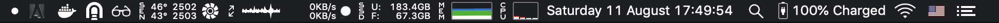

# New Environment Bootstrap

* Run `./setup.sh` and follow the instructions
* Manually install
  * VLC
  * Microsoft Office
  * Stremio
  * TeamViewer
  * Disk Inventory X
  * Adobe Photoshop
  * Spectacle
  * Transmission
  * High Sierra Media Key Enabler
    * Open at login
* Change settings
  * OSX
    * Hot corner to lock
    * Reduce keypress for accents as much as possible
    * Put dock on the right
    * Disable dashboard
    * Reverse scroll
    * Make trackpad as easy as possible
    * Backup
  * iStat Menu
    * Change fan configuration to keep CPU cool
    * Try to make it look like this  
  * VScode
    * Import configuration
    * Install extensions
      * VS Live Share
      * Go
      * LaTeX Workshop
      * markdownlint
      * C/C++
      * Docker
      * Git history
      * GitLens
      * dep
      * Material Theme
      * One Monokay Theme
      * Prettier
